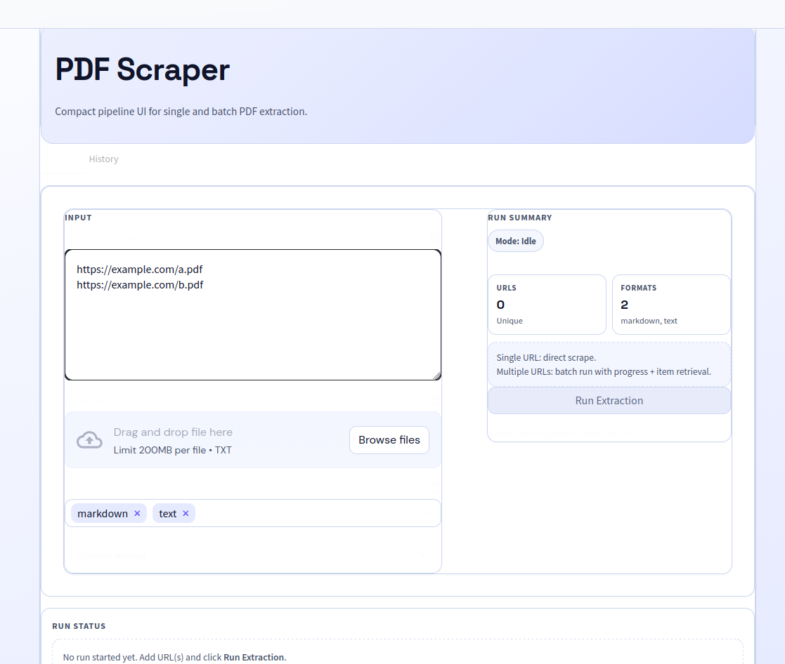

# Olostep PDF Scraper

[](#requirements)
[](#license)

Scrape PDFs via the [Olostep API](https://www.olostep.com/) and export **structured content** (aggregate JSON) plus **per-format files** (Markdown/HTML/Text/JSON) into `output/`.
The workflow follows the [Olostep documentation](https://docs.olostep.com/get-started/welcome) for single and batch scraping patterns.



---

## Table of Contents

- [Features](#features)
- [Requirements](#requirements)
- [Quick Start](#quick-start)
- [Configuration](#configuration)
- [Usage](#usage)
- [CLI Reference](#cli-reference)
- [Output Layout](#output-layout)
- [Project Structure](#project-structure)
- [Development](#development)
- [Notes](#notes)
- [Olostep References](#olostep-references)
- [License](#license)

---

## Features

- **Single PDF** scrape via [Olostep `/v1/scrapes`](https://docs.olostep.com/features/scraping/scrape-pdf)
- **Batch scraping** via [Olostep `/v1/batches`](https://docs.olostep.com/features/batches/batches), polling, and per-item retrieval via `GET /v1/retrieve`
- Produces one aggregate JSON file plus extracted content files per format under `output/`
- Format support: `markdown`, `text`, `html`, `json`
- Batch retrieve formats are normalized to `html|markdown|json`

## Requirements

- Python **3.10+**
- `pip`
- An Olostep API key (generate one from the [Olostep API Keys dashboard](https://www.olostep.com/dashboard/api-keys))

---

## Quick Start

### 1) Install dependencies

```bash
git clone <YOUR_REPO_URL>.git
cd <YOUR_REPO_DIR>
pip install -r requirements.txt
```

### 2) Configure API key

```bash
cp .env.example .env
```

Then set your key:

```bash
OLOSTEP_API_KEY="YOUR_KEY"
```

If you do not have a key yet, create one from the [Olostep API Keys dashboard](https://www.olostep.com/dashboard/api-keys).

### 3) Run your first scrape

```bash
python main.py --url "https://example.com/file.pdf"
```

---

## Configuration

### Environment variables

This project reads the Olostep API key from `.env`:

- `OLOSTEP_API_KEY` **(required)**: Olostep API key used for authentication

Example `.env`:

```bash
OLOSTEP_API_KEY="YOUR_KEY"
```

### Code defaults

Defaults live in `config/config.py`:

- `OUTPUT_DIR`: `output`
- `DEFAULT_FORMATS`: `markdown,text`
- `DEFAULT_OUT_FILE`: `output.json`
- `DEFAULT_POLL_SECONDS`: `5`
- `DEFAULT_ITEMS_LIMIT`: `50`
- `LOG_LEVEL`: `INFO` (`DEBUG`, `INFO`, `WARNING`, `ERROR`)

---

## Usage

### Single PDF

Scrape a single PDF URL:

```bash
python main.py --url "https://example.com/file.pdf"
```

Specify formats and output name:

```bash
python main.py --url "https://example.com/file.pdf" --formats markdown,text --out single.json
```

### Batch PDFs

Create `test_urls.txt` (one URL per line, `#` comments supported):

```text
https://site.com/a.pdf
https://site.com/b.pdf
```

Run:

```bash
python main.py --urls-file test_urls.txt --out batch.json
```

### Repeatable `--url`

You can pass multiple `--url` flags:

```bash
python main.py --url "https://site.com/a.pdf" --url "https://site.com/b.pdf"
```

### How modes work

- **Single mode**: calls `/v1/scrapes` and writes the response plus extracted files (no `/v1/retrieve`)
- **Batch mode**: creates a batch via `/v1/batches`, polls until items complete, then calls `/v1/retrieve` per completed item

---

## CLI Reference

| Flag | Description |
| --- | --- |
| `--url` | PDF URL (**repeatable**) |
| `--urls-file` | Text file with 1 URL per line (`#` comments supported) |
| `--out` | Output JSON filename (written under `output/`) |
| `--formats` | Comma-separated formats, e.g. `markdown,text,html` |
| `--poll-seconds` | Batch polling interval (seconds) |
| `--items-limit` | Batch item page size |

### Format behavior notes

- **Single mode**: `--formats` is passed through to `/v1/scrapes`
- **Batch mode**: retrieve formats are filtered to `html|markdown|json`
- If none match, `formats` is omitted when calling `/v1/retrieve` (Olostep returns all formats)

---

## Output Layout

### Aggregate JSON

Written to:

- If `--out` is set: `output/<out>`
- If `--out` omitted (single): `output/single_{HH-MM}_{YYYY-MM-DD}.json`
- If `--out` omitted (batch): `output/batch{count}_{HH-MM}_{YYYY-MM-DD}.json`

### Extracted content files

Written under `output/` as `<custom_id>.<ext>` when that format exists:

- Single mode: `custom_id` is `pdf-1` (example: `output/pdf-1.md`)
- Batch mode: `custom_id` defaults to the item index (`0`, `1`, `2`, ...)
- Batch examples: `output/0.md`, `output/1.html`

---

## Project Structure

```text
.
├── app.py                    # Streamlit UI for single/batch PDF scraping
├── main.py                   # CLI entrypoint and argument parsing
├── config/
│   └── config.py             # Runtime defaults and environment settings
├── src/
│   ├── workflow.py           # Orchestrates single and batch execution paths
│   ├── single_pdf_scraper.py # Single-PDF scrape helper (`/v1/scrapes`)
│   └── batch_scraper.py      # Batch create/poll/retrieve client
├── utils/
│   └── pipeline_io.py        # Output writing and format file handling
├── test/                     # Tests for workflow and batch/single behavior
├── test_urls.txt             # Sample input URL list for batch mode
└── output/                   # Generated run artifacts
```

---

## Development

Recommended workflow:

```bash
python -m venv .venv
source .venv/bin/activate   # Windows: .venv\Scripts\activate
pip install -r requirements.txt
cp .env.example .env
```

Run locally:

```bash
python main.py --url "https://example.com/file.pdf"
```

## Notes

- In single mode, extracted files are written using `custom_id=pdf-1` by default.
- In batch mode, each completed item is retrieved and written as its own file set.
- Batch retrieve formats are constrained to `html`, `markdown`, or `json`.
- If no allowed retrieve formats remain after filtering, `/v1/retrieve` is called without `formats`.

## Olostep References

- [Olostep Documentation](https://docs.olostep.com/)
- [Olostep Scrape PDF Guide](https://docs.olostep.com/features/scraping/scrape-pdf)
- [Olostep Batch Guide](https://docs.olostep.com/features/batches/batches)

## License
This project is licensed under the MIT License.

See [`LICENSE`](LICENSE) file for full details.
